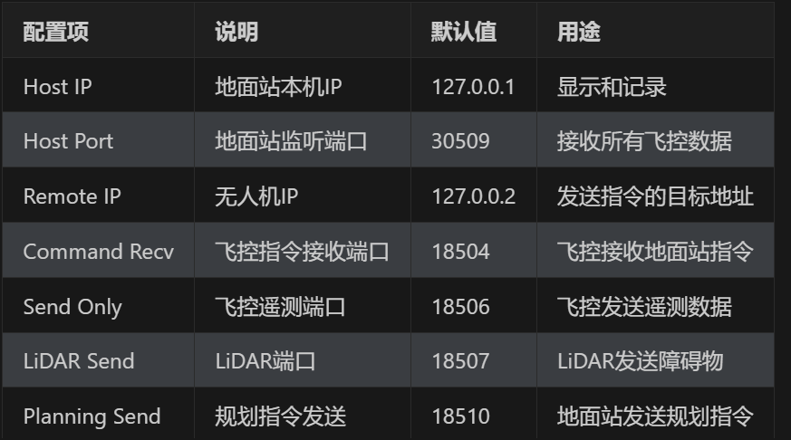

# Apollo-GCS Web 配置说明

## 一、系统架构概述

### 1.1 通信端口分配

```
地面站（后端）
├── HTTP/WebSocket: 8000
│   ├── REST API: 前端配置管理、指令发送
│   └── WebSocket: ws://localhost:8000/ws/drone
│
└── UDP服务器端口：
    ├── 30509: 总监听端口（接收所有飞控数据）
    ├── 18506: 飞控遥测端口（ExtY_FCS_*）
    ├── 18507: LiDAR数据端口（障碍物信息）
    └── 18511: 规划系统端口（规划响应）

无人机（飞控）
├── 18504: 接收地面站指令端口（ExtU_FCS，即飞控的RECEIVE_PORT）
├── 18506: 发送遥测数据端口
├── 18507: 发送LiDAR数据端口
├── 18510: 接收规划指令端口
└── 18511: 发送规划响应端口
```

### 1.2 端口关系说明

```
前端配置 → HTTP POST → 后端 → 重启UDP服务器 → 无人机

配置说明：
- Host IP (127.0.0.1): 地面站本机IP，用于显示和记录
- Host Port (30509): 地面站UDP监听端口，接收飞控数据
- Remote IP (127.0.0.2): 无人机IP，发送指令的目标地址
- Command Recv Port (18504): 飞控接收地面站指令的端口
- Send Only Port (18506): 飞控发送遥测数据的端口
- LiDAR Send Port (18507): LiDAR发送障碍物数据的端口
- Planning Send Port (18510): 地面站发送规划指令的端口
- Planning Recv Port (18511): 规划系统发送响应的端口
```

## 二、前端配置说明

### 2.1 配置中心（左侧面板）

#### 2.1.1 连接配置

**本地端（GCS）配置：**
```
Protocol: 协议类型（UDP/Serial）
Host IP: 地面站IP（如 127.0.0.1）
Host Port: 地面站监听端口（如 30509）
```

**远程端（飞控）配置：**
```
Remote IP: 无人机IP（如 127.0.0.2）
Command Recv: 指令接收端口（18504）飞控接收地面站指令的端口
遥测端口: 飞控遥测端口（18506）
障碍接收: LiDAR数据端口（18507）
指令发送: 规划指令发送端口（18510）
响应接收: 规划响应接收端口（18511）
```

**配置流程：**
1. 修改配置参数
2. 点击"连接 UDP"按钮保存配置
3. 后端自动重启UDP服务器
4. WebSocket推送配置更新通知

#### 2.1.2 数据记录配置

**配置项：**
```
Log Directory: 日志保存目录
Auto Record: 自动记录开关（开启/关闭）
Log Format: 日志格式（CSV/Binary）
Log Level: 日志级别（DEBUG/INFO/WARNING/ERROR）
```

**保存日志配置：**
点击"保存日志配置"按钮，后端将保存配置并创建或关闭日志文件

### 2.2 顶部状态栏

**显示内容：**
```
Apollo-GCS [Logo]

连接: [●] 已连接/未连接
后端: 运行中/已停止

时间: HH:MM:SS
```

**状态说明：**
- **连接**: WebSocket连接状态
  - 绿色圆点闪烁：已连接
  - 红色圆点：未连接
  
- **后端**: UDP服务器运行状态
  - 绿色"运行中"：UDP服务器正在运行
  - 红色"已停止"：UDP服务器已停止

## 三、后端API接口

### 3.1 获取连接配置

```http
GET /api/config/connection
```

**响应：**
```json
{
  "type": "connection_config",
  "data": {
    "protocol": "udp",
    "hostIp": "127.0.0.1",
    "hostPort": 30509,
    "remoteIp": "127.0.0.2",
    "commandRecvPort": 18504,
    "sendOnlyPort": 18506,
    "lidarSendPort": 18507,
    "planningSendPort": 18510,
    "planningRecvPort": 18511
  },
  "timestamp": 1705289900000
}
```

### 3.2 更新连接配置

```http
POST /api/config/connection
Content-Type: application/json

{
  "protocol": "udp",
  "hostIp": "127.0.0.1",
  "hostPort": 30509,
  "remoteIp": "127.0.0.2",
  "commandRecvPort": 18504,
  "sendOnlyPort": 18506,
  "lidarSendPort": 18507,
  "planningSendPort": 18510,
  "planningRecvPort": 18511
}
```

**响应：**
```json
{
  "status": "success",
  "message": "连接配置已更新"
}
```

### 3.3 获取日志配置

```http
GET /api/config/log
```

**响应：**
```json
{
  "type": "log_config",
  "data": {
    "logDirectory": "./logs",
    "autoRecord": true,
    "logFormat": "csv",
    "logLevel": "1"
  },
  "timestamp": 1705289900000
}
```

### 3.4 更新日志配置

```http
POST /api/config/log
Content-Type: application/json

{
  "logDirectory": "./logs",
  "autoRecord": true,
  "logFormat": "csv",
  "logLevel": "1"
}
```

**响应：**
```json
{
  "status": "success",
  "message": "日志配置已更新"
}
```

## 四、WebSocket实时通信

### 4.1 连接端点

```
ws://localhost:8000/ws/drone
```

### 4.2 消息类型

#### 4.2.1 服务器推送消息

**连接建立：**
```json
{
  "type": "connection",
  "status": "connected",
  "message": "WebSocket连接已建立",
  "timestamp": 1705289900000
}
```

**UDP数据推送：**
```json
{
  "type": "udp_data",
  "timestamp": 1705289900000,
  "data": {
    "cmd": 0x42,
    "message_type": "ExtY_FCS_STATES",
    "states_lat": 39.1234,
    "states_lon": 117.5678,
    "states_height": 100.0,
    "states_Vx_GS": 20.0,
    "states_Vy_GS": 5.0,
    "states_Vz_GS": 2.0,
    "states_phi": 0.1,
    "states_theta": 0.05,
    "states_psi": 1.57
  }
}
```

**配置更新通知：**
```json
{
  "type": "config_update",
  "config_type": "connection",
  "data": {...},
  "timestamp": 1705289900000
}
```

**指令响应：**
```json
{
  "type": "command_response",
  "command": "takeoff",
  "status": "success",
  "message": "指令已发送",
  "timestamp": 1705289900000
}
```

#### 4.2.2 客户端发送消息

**获取配置：**
```json
{
  "type": "get_config",
  "data": {"config_type": "all"}
}
```

**紧急停止：**
```json
{
  "type": "command",
  "data": {
    "command": "emergency_stop",
    "params": {}
  }
}
```

## 五、使用示例

### 5.1 启动系统

**启动后端：**
```bash
cd Apollo-GCS-Web/src-python
python main.py
```

后端将显示：
```
============================================================
地面站配置信息
============================================================
运行模式: production
接收配置: 0.0.0.0:30509
发送目标: 127.0.0.2:18504
============================================================

INFO:     Uvicorn running on http://0.0.0.0:8000 (Press CTRL+C to quit)
```

**启动前端：**
```bash
cd Apollo-GCS-Web/src-frontend
npm run dev
```

前端将运行在：http://localhost:5173

### 5.2 配置连接

1. 打开浏览器访问 http://localhost:5173
2. 左侧面板选择"配置中心"
3. 修改"连接配置"参数：
   - Host IP: 127.0.0.1
   - Host Port: 30509
   - Remote IP: 127.0.0.2
   - Command Recv: 18504
   - 其他端口保持默认
4. 点击"连接 UDP"按钮保存配置

### 5.3 配置日志记录

1. 在"配置中心"找到"数据记录"区域
2. 配置日志保存目录（如 ./logs）
3. 开启"Auto Record"开关
4. 选择日志格式（CSV）
5. 选择日志级别（INFO）
6. 点击"保存日志配置"按钮

## 六、网络配置要求

### 6.1 网络拓扑

```
┌─────────────────────────────────────────┐
│        同一网络段内                   │
│                                         │
│  地面站 (127.0.0.1)        无人机 (127.0.0.2)  │
│  Windows 11               Linux/飞控系统   │
│  运行Python后端          运行飞控程序       │
│  UDP监听端口：            UDP监听端口：      │
│  - 30509 (总入口)        - 18504 (接收)    │
│  - 18506 (遥测)          - 18506 (发送)    │
│  - 18507 (LiDAR)         - 18507 (发送)    │
│  - 18511 (规划响应)       - 18511 (发送)    │
│                                         │
│  数据流向：                                │
│  地面站 ←── [UDP数据] ←──── 无人机            │
│  地面站 ──── [指令] ─────→ 无人机            │
│                                         │
└─────────────────────────────────────────┘
```

### 6.2 防火墙配置

**地面站防火墙：**
- 允许UDP端口 30509, 18506, 18507, 18511 入站
- 允许HTTP端口 8000 入站

**无人机防火墙：**
- 允许UDP端口 18504, 18510 入站

### 6.3 IP地址配置

**地面站IP配置：**
- 建议使用静态IP地址
- 示例：127.0.0.1（测试环境）
- 示例：192.168.1.100（生产环境）

**无人机IP配置：**
- 建议使用静态IP地址
- 示例：127.0.0.2（测试环境）
- 示例：192.168.1.10（生产环境）

**网关和DNS：**
- 确保两台设备在同一网段
- 网关可能不需要配置（仅直连通信）
- DNS配置不影响UDP通信

## 七、故障排查

### 7.1 无法连接WebSocket

**检查项：**
1. 后端是否正常运行（访问 http://localhost:8000）
2. 浏览器控制台是否有错误信息
3. 网络连接是否正常

**解决方案：**
- 重启后端服务
- 检查前端WebSocket连接URL是否正确
- 查看后端日志确认WebSocket连接状态

### 7.2 无法接收UDP数据

**检查项：**
1. UDP服务器是否启动（后端日志确认）
2. 防火墙是否阻止UDP端口
3. 无人机是否发送数据到正确地址

**解决方案：**
- 检查配置中的IP地址和端口是否正确
- 使用Wireshark抓包查看UDP数据包
- 确认两台设备在同一网段
- 检查防火墙设置

### 7.3 无法发送指令

**检查项：**
1. 后端UDP服务器是否正常运行
2. 配置中的Remote IP和Command Recv Port是否正确
3. 无人机是否监听18504端口

**解决方案：**
- 检查后端发送日志
- 确认目标IP地址可达（ping测试）
- 检查无人机端防火墙设置

### 7.4 日志记录失败

**检查项：**
1. 日志目录是否有写入权限
2. 磁盘空间是否充足
3. 日志配置是否正确

**解决方案：**
- 检查日志目录权限
- 清理磁盘空间
- 查看后端日志中的错误信息

## 八、最佳实践

### 8.1 配置管理

1. **使用测试环境验证**
   - 先在本地测试环境验证配置
   - 确认无误后再部署到生产环境

2. **备份配置**
   - 定期备份配置文件
   - 记录每次配置变更

3. **文档化配置**
   - 记录网络拓扑和IP分配
   - 文档化端口用途和协议

### 8.2 网络优化

1. **使用有线网络**
   - 优先使用以太网连接
   - 避免Wi-Fi干扰

2. **网络隔离**
   - 将地面站和无人机放在独立网络
   - 减少网络干扰

3. **带宽分配**
   - 确保足够的网络带宽
   - 监控网络延迟和丢包率

### 8.3 日志管理

1. **定期清理日志**
   - 设置日志轮转策略
   - 定期清理旧日志文件

2. **日志级别选择**
   - 生产环境使用INFO级别
   - 调试时使用DEBUG级别

3. **日志备份**
   - 定期备份重要日志文件
   - 使用压缩减少存储空间

## 九、安全建议

### 9.1 网络安全

1. **使用防火墙**
   - 只开放必要的端口
   - 限制访问源IP地址

2. **网络安全**
   - 使用VPN或专网
   - 避免将系统暴露到公网

3. **定期更新**
   - 更新系统和依赖库
   - 修复已知安全漏洞

### 9.2 配置安全

1. **敏感信息保护**
   - 不要在日志中记录敏感信息
   - 使用环境变量存储敏感配置

2. **访问控制**
   - 限制配置修改权限
   - 记录配置变更历史

3. **数据加密**
   - 考虑使用TLS加密WebSocket
   - 加密存储敏感配置

## 十、常见问题（FAQ）

### Q1: 为什么需要配置18504端口？

**A:** 18504端口是飞控接收地面站指令的端口（即飞控的RECEIVE_PORT）。地面站发送指令时，需要知道飞控监听的端口，这样才能正确发送控制指令。

### Q2: Host IP和Remote IP有什么区别？

**A:** 
- **Host IP**: 地面站本机的IP地址，用于显示和记录
- **Remote IP**: 无人机的IP地址，是地面站发送指令的目标地址

### Q3: 为什么需要监听多个UDP端口？

**A:** 飞控系统使用不同的UDP端口发送不同类型的数据：
- 18506: 飞控遥测数据
- 18507: LiDAR障碍物数据
- 18511: 规划系统响应数据
地面站需要监听这些端口以接收完整的遥测信息。

### Q4: 顶部状态栏的"连接"和"后端"有什么区别？

**A:** 
- **连接**: WebSocket连接状态，表示前端与后端的通信状态
- **后端**: UDP服务器运行状态，表示后端与无人机的通信状态

### Q5: 如何确认UDP通信正常？

**A:** 
1. 查看后端日志，确认UDP数据包接收
2. 使用Wireshark抓包，查看UDP数据包
3. 查看前端状态栏，看是否有数据更新

### Q6: 配置变更后需要重启后端吗？

**A:** 不需要。保存配置后，后端会自动重启UDP服务器，应用新配置。前端通过WebSocket接收配置更新通知。

## 十一、版本历史

### v1.1.0 (当前版本)
- 新增：添加飞控指令接收端口（18504）配置
- 改进：简化顶部状态栏显示
- 改进：将数据记录配置移到连接配置下方
- 修复：修复WebSocket生命周期警告
- 修复：修复ECharts图表初始化问题

### v1.0.0
- 初始版本
- 实现基础HTTP REST API
- 实现WebSocket实时通信
- 实现UDP协议解析
- 实现前端配置界面

## 十二、技术支持

如有问题，请联系：
- 项目地址：GitHub/Apollo-GCS-Web
- 问题报告：GitHub Issues
- 文档地址：Apollo-GCS-Web/Docs


