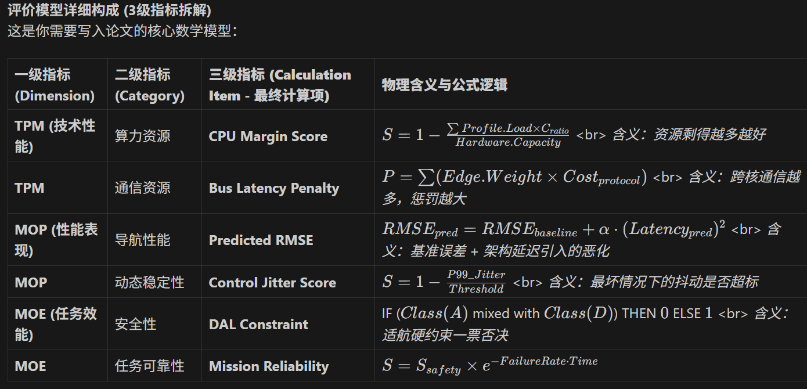

# eVTOL 航电系统逻辑架构评估与优化：实验研究方案 (V2.0 完善版)

## 1. 研究背景与核心思想

本研究旨在解决 eVTOL 航电系统在多核异构平台（如 Huawei MDC610）上的功能分配优化问题。核心思想是 **“数据驱动的 MBSE 闭环”**，即：
**Log (HIL) -> Feature (Profile) -> Evaluation (MOE/MOP/TPM) -> Optimization (GA)**

### 1.1 方案亮点分析
*   **模型与数据解耦 (Decoupling)**: 
    *   **Mapping Phase**: 负责基准校准（Ground Truth）。
    *   **Evaluation Phase**: 负责架构推演（Prediction）。
    *   *价值*: 解决了 HIL 无法实时动态重构硬件以验证每种可能架构的痛点。
*   **多维度层级性 (Hierarchy)**:
    *   采用 **MOE-MOP-TPM** 体系，将微观数据（包延迟）聚合为宏观指标（任务成功率）。
*   **余量导向评估 (Margin-Oriented)**:
    *   引入 $Score = 1 - Load/Capacity$ 机制，符合航空领域对鲁棒性的极致追求。
*   **跨层级预测 (Inter-layer Prediction)**:
    *   建立了 $Latency (TPM) \rightarrow RMSE (MOP)$ 的非线性关联，实现了物理层变化对功能层影响的量化。

---

## 2. 实验阶段详细说明

### 第一阶段：基准架构建模与物理映射 (Modeling & Mapping)
*   **目标**: 建立逻辑功能与物理数据的索引关系。
*   **关键产物**: `config.py` (MappingConfig)，定义了“去哪里找这个功能的基准表现”。

### 第二阶段：数据特征提取 (Feature Extraction)
*   **目标**: 建立 "功能指纹库" (Function Profile)。
*   **数据源**: HIL 仿真日志 (Telemetry, Bus Traffic, OS Trace)。
*   **关键改进**: 引入 P95/P99 统计值以评估最坏情况。

### 第三阶段：架构综合评价与寻优 (Evaluation & Optimization)
*   **目标**: 基于特征库，预测新架构方案的得分，并寻找最优解。
*   **核心**: 异构与通信代价预测模型。

---

## 3. 核心算法与评价模型详解 (Detailed Models)

针对异构平台 (MDC610) 特性和航空适航要求，构建以下五个核心子模型：

### 3.1 方案一：异构平台算力等效性模型 (Compute Equivalence)
解决 SoC (Linux/AI核) 与 MCU (RTOS/控制核) 算力不对等的问题。

*   **基准测试**: 选取标准算法（如矩阵乘法）在两端运行。
*   **算力系数 ($C_{ratio}$)**:
    $$C_{ratio} = \frac{T_{mcu\_benchmark}}{T_{soc\_benchmark}}$$
    (通常 $C_{ratio} > 1$，意味着同样功能在 MCU 上耗时更长)
*   **预测公式**:
    当功能 $f$ 从 SoC 移至 MCU 时：
    $$Load_{pred}(f, MCU) = Load_{measured}(f, SoC) \times C_{ratio} \times \alpha_{safety}$$
    其中 $\alpha_{safety}$ 为安全冗余系数 (如 1.2)。

### 3.2 方案二：多级通信代价矩阵模型 (Comm Cost Matrix)
区分同一芯片内通信与跨芯片通信的巨大差异。

*   **通信场景分类**:
    1.  **Intra-Partition (L1)**: 进程内/零拷贝 (Cost $\approx 0$).
    2.  **Inter-Partition (L2)**: SoC 内部共享内存/DDS (Cost: 序列化/反序列化).
    3.  **Inter-Node (L3)**: SoC <-> MCU (SOME/IP over Ethernet).
*   **延迟预测**:
    $$Latency_{pred} = T_{logic} + Cost_{protocol\_overhead} + T_{transmission}$$
    *   若变为跨节点 (L3)，增加 $T_{someip\_delay}$ 和 MCU CPU 负载 $U_{someip}$。
*   **参数来源**: HIL 协议栈压力测试测得 $U_{someip}$ (单包CPU消耗) 和 $T_{overhead}$。

### 3.3 方案三：适航安全性硬约束模型 (Safety Constraints)
基于 DAL (Design Assurance Level) 的物理隔离要求。

*   **输入**: 功能安全等级 ($L_f \in \{A, B, C, D, E\}$)。
*   **约束逻辑**:
    1.  **DAL A (关键)** 必须分配至 RTOS (MCU) 或 经认证的分区。
    2.  **隔离规则**:若 DAL A 与 DAL D (非关键) 位于同一核心，且无 Hypervisor 隔离 -> **违规**。
*   **GA 惩罚函数**:
    ```python
    def check_constraints(individual):
        if has_critical_mixed_with_non_critical(individual):
            return FITNESS_MIN (Penalty = Infinity)
    ```

### 3.4 方案四：基于 P95/P99 的稳定性评估模型 (Worst-Case Analysis)
避免均值掩盖偶发长尾延迟风险。

*   **综合指标计算**:
    $$V_{eval} = \omega \cdot \mu + (1 - \omega) \cdot P_{95}$$
    *   对于飞控 (FCS): $\omega = 0.3$ (主要看 P95，关注最坏情况).
    *   对于监控 (Monitor): $\omega = 0.8$ (主要看均值).
*   **总线预警**: 若 Ethernet 总线利用率 $P_{99} > 70\%$, 施加额外非线性惩罚。

### 3.5 方案五：MOP 非线性衰减预测模型 (Non-linear Degradation)
延迟对飞行性能的影响存在临界点 (Threshold)。

*   **衰减函数**:
    $$S_{MOP\_factor} = \begin{cases} 
    1 - \frac{Delay}{T_{threshold}} & \text{if } Delay < T_{threshold} \\
    e^{-k \cdot (Delay - T_{threshold})} & \text{if } Delay \ge T_{threshold} 
    \end{cases}$$
    *   $T_{threshold}$: 控制周期 (如 20ms).
    *   含义: 超过控制周期后，性能得分呈指数级“崩溃”。
*   **RMSE 预测**:
    $$RMSE_{pred} = RMSE_{baseline} + a \cdot (\Delta Latency)^2$$

---

## 4. 后端数据处理流水线 (Data Pipeline)

如何从 HIL 原始“数据包”转化为“性能 Profile”：

1.  **Capture (捕获)**: 
    *   接收 UDP 数据包 (ID: 0x101, Size: 256B).
2.  **Identify (识别)**: 
    *   查 Mapping 表 -> 对应 Capella `LF_Perception` 或 `FE_Cloud_Points`.
3.  **Process (加工)**:
    *   **TPM**: 累加该 ID 在 1s 窗口内的总字节数 -> `Bandwidth`.
    *   **MOP**: 解析 Payload (Pos_Cmd, Pos_Act) -> 计算 $(Cmd - Act)^2$.
    *   **Stats**: 存入滑动窗口，计算 Mean, Std, P95.
4.  **Profile (归档)**:
    *   输出 JSON: `{ "LF_Perception": { "cpu_load_p95": 0.12, "bandwidth_out": 5MBps } }`.

---

## 5. 核心实验参数表 (Key Parameters)

在 Python 代码 (`config.py` 或 `evaluation_model.py`) 中需维护的核心常量：

| 参数类别 | 参数代号 | 物理含义 | 取值来源 | 应用场景 |
| :--- | :--- | :--- | :--- | :--- |
| **算力** | $C_{ratio}$ | SoC/MCU 算力比 | HIL 基准测试 (FFT/Matrix) | 异构迁移负载预测 |
| **通信** | $U_{someip}$ | 单包序列化 CPU 消耗 | 协议栈压力测试 | 跨核通信 CPU 增量计算 |
| **通信** | $T_{overhead}$ | 协议栈延迟基数 | Wireshark 抓包统计 | 跨核延迟预测 |
| **安全** | $Matrix_{DAL}$ | 适航隔离规则矩阵 | 适航需求文档 (DO-178C) | GA 适应度硬约束检查 |
| **性能** | $T_{threshold}$ | 失稳延迟阈值 | 飞行力学仿真 (20-50ms) | MOP 评分指数衰减 |
| **统计** | $\omega$ | 均值权重系数 | 经验值 (0.3 for Critical) | 稳定性特征提取 |

---

## 6. 代码实施与修改计划

### 6.1 `dsm_generator.py` (特征提取器)
*   **新增**: 增加 `numpy` 计算 P95/P99。
*   **新增**: 集成 ESC 电流积分逻辑。
*   **新增**: 实现基于时间滑动窗口的流量统计。

### 6.2 `evaluation_model.py` (评价引擎)
*   **重构**: 引入 `HardwareSpecs` 类，包含 `$C_{ratio}$` 等异构参数。
*   **重构**: 实现 `constraints_check()` 函数 (DAL 检查)。
*   **重构**: 升级 `_evaluate_mop` 为非线性衰减模型。

### 6.3 `optimization_ga.py` (遗传算法 - 新增)
*   **任务**: 编写 GA 框架，调用 `evaluation_model` 计算 Fitness。
*   **基因编码**: 数组 `[0, 1, 0, 2...]` 对应功能分配到的 Node ID。
