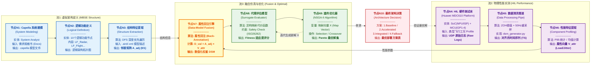

```mermaid
flowchart LR
    %% ======================================================================================
    %% 样式定义 (Style Definitions)
    %% ======================================================================================
    classDef virtual fill:#E3F2FD,stroke:#1565C0,stroke-width:2px,color:#0D47A1
    classDef physical fill:#F3E5F5,stroke:#6A1B9A,stroke-width:2px,color:#4A148C
    classDef fusion fill:#FFF9C4,stroke:#F57C00,stroke-width:3px,color:#E65100,font-weight:bold
    classDef optim fill:#E8F5E9,stroke:#2E7D32,stroke-width:2px,color:#1B5E20
    classDef result fill:#FFEBEE,stroke:#C62828,stroke-width:2px,color:#B71C1C

    %% ======================================================================================
    %% 泳道 1: 虚拟架构流 (Virtual Stream - Capella MBSE)
    %% ======================================================================================
    subgraph S1["流1: 虚拟架构定义 (MBSE Structure)"]
        direction TB
        
        N1["<b>节点N1: Capella 系统建模</b><br/>(System Modeling)<br/>-----------------<br/>实体: System Analyst<br/>输入: 需求规格书 (Docs)<br/>输出: .capella 模型文件"]:::virtual
        
        N2["<b>节点N2: 逻辑功能定义</b><br/>(Logical Definition)<br/>-----------------<br/>实体: 10个逻辑功能节点<br/>内容: LF_Radar, LF_Flight...<br/>输出: 逻辑架构拓扑图"]:::virtual
        
        N3["<b>节点N3: 结构特征提取</b><br/>(Structure Extraction)<br/>-----------------<br/>算法: DFS 深度优先遍历<br/>输入: .aird/.xml 模型描述<br/>输出: <b>邻接矩阵 A_adj (0/1)</b>"]:::virtual
        
        N1 --> N2 --> N3
    end

    %% ======================================================================================
    %% 泳道 2: 物理数据流 (Physical Stream - HIL Testbed)
    %% ======================================================================================
    subgraph S2["流2: 物理性能实测 (HIL Performance)"]
        direction TB
        
        N4["<b>节点N4: HIL 硬件测试床</b><br/>(Huawei MDC610 Platform)<br/>-----------------<br/>实体: SoC(NPU/ISP) + MCU(GP1-4)<br/>输入: 典型飞行工况 Profile<br/>输出: <b>UDP 原始日志 (Raw Logs)</b>"]:::physical
        
        N5["<b>节点N5: 数据清洗管道</b><br/>(Data Processing Pipe)<br/>-----------------<br/>算法: ZOH插值 + 50Hz重采样<br/>实现: dsm_generator.py<br/>输出: <b>对齐的时间序列 (TS)</b>"]:::physical
        
        N6["<b>节点N6: 性能特征提取</b><br/>(Component Profiling)<br/>-----------------<br/>算法: P95 统计 / 均值计算<br/>输出: <b>属性向量 V_attr (Load/Jitter)</b>"]:::physical

        N4 --> N5 --> N6
    end

    %% ======================================================================================
    %% 泳道 3: 融合与优化闭环 (Fusion & Optimization)
    %% ======================================================================================
    subgraph S3["流3: 融合仿真与优化 (Fusion & Optimal)"]
        direction TB
        
        N7["<b>节点N7: 属性回注引擎</b><br/>(Data-Model Fusion)<br/>-----------------<br/>算法: 属性回注 (Back-Annotation)<br/>计算: D_val = A_adj × V_attr<br/>输出: <b>数值化权重 DSM</b>"]:::fusion
        
        N8["<b>节点N8: 代理评估模型</b><br/>(Surrogate Evaluator)<br/>-----------------<br/>算法: 异构映射代价函数<br/>约束: Safety Check (ISO26262)<br/>输出: <b>Fitness 适应度评分</b>"]:::optim
        
        N9["<b>节点N9: 遗传优化器</b><br/>(NSGA-II Algorithm)<br/>-----------------<br/>变量: 映射向量 X (Map Vector)<br/>操作: Selection / Crossover<br/>输出: <b>Pareto 最优解集</b>"]:::optim
        
        %% 融合连接 - 修正后的连接线语法
        N3 -->|结构信息| N7
        N6 -->|性能参数| N7
        
        %% 闭环连接
        N7 --> N8
        N8 --> N9
        N9 -.->|迭代生成新解 X| N8
    end

    %% ======================================================================================
    %% 最终产物
    %% ======================================================================================
    N10["<b>节点N10: 最终架构决策</b><br/>(Architecture Decision)<br/>-----------------<br/>方案: 1.Baseline / 2.Accelerated<br/>3.Integrated / 4.Fallback<br/>输出: <b>最优部署方案表</b>"]:::result
    
    N9 -->|收敛| N10
    
    %% ======================================================================================
    %% 反馈回路 (Validation Logic)
    %% ======================================================================================
    N10 -.->|验证最优解| N4
```