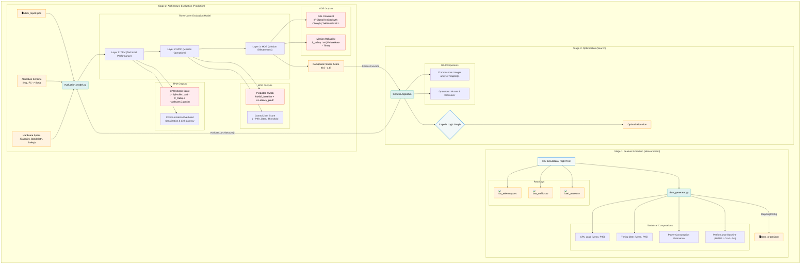

```mermaid
graph TD
    subgraph " "
        direction LR
        subgraph "Stage 1: Feature Extraction (Measurement)"
            direction TB
            
            A1[HIL Simulation / Flight Test] --> A2(dsm_generator.py);
            
            subgraph "Raw Logs"
                direction TB
                A1_1["<img src='https://img.icons8.com/ios-filled/50/000000/document.png' width='20'/> fcs_telemetry.csv"]
                A1_2["<img src='https://img.icons8.com/ios-filled/50/000000/document.png' width='20'/> bus_traffic.csv"]
                A1_3["<img src='https://img.icons8.com/ios-filled/50/000000/document.png' width='20'/> load_trace.csv"]
            end
            A1 --> A1_1;
            A1 --> A1_2;
            A1 --> A1_3;

            A2 -- "MappingConfig" --> A3["fa:fa-file-code dsm_report.json"];
            
            subgraph "Statistical Computations"
                A2_1["CPU Load (Mean, P95)"]
                A2_2["Timing Jitter (Mean, P95)"]
                A2_3["Power Consumption Estimation"]
                A2_4["Performance Baseline (RMSE = Cmd - Act)"]
            end
            A2 --> A2_1;
            A2 --> A2_2;
            A2 --> A2_3;
            A2 --> A2_4;
        end

        subgraph "Stage 2: Architecture Evaluation (Prediction)"
            direction TB
            
            B1["fa:fa-file-code dsm_report.json"] --> B4(evaluation_model.py);
            B2["Allocation Scheme<br/>(e.g., FC -> SoC)"] --> B4;
            B3["Hardware Specs<br/>(Capacity, Bandwidth, Safety)"] --> B4;
            
            subgraph "Three-Layer Evaluation Model"
                direction TB
                B4_1["Layer 1: TPM (Technical Performance)"] --> B4_2["Layer 2: MOP (Mission Operations)"];
                B4_2 --> B4_3["Layer 3: MOE (Mission Effectiveness)"];
            end
            B4 --> B4_1;
            
            subgraph "TPM Outputs"
                B4_1_1["CPU Margin Score<br/>1 - Σ(Profile.Load * C_Ratio) / Hardware.Capacity"]
                B4_1_2["Communication Overhead<br/>Serialization & Link Latency"]
            end
            B4_1 --> B4_1_1;
            B4_1 --> B4_1_2;

            subgraph "MOP Outputs"
                B4_2_1["Predicted RMSE<br/>RMSE_baseline + α·Latency_pred²"]
                B4_2_2["Control Jitter Score<br/>1 - P99_Jitter / Threshold"]
            end
            B4_2 --> B4_2_1;
            B4_2 --> B4_2_2;

            subgraph "MOE Outputs"
                B4_3_1["DAL Constraint<br/>IF Class(A) mixed with Class(D) THEN 0 ELSE 1"]
                B4_3_2["Mission Reliability<br/>S_safety * e^(-FailureRate * Time)"]
            end
            B4_3 --> B4_3_1;
            B4_3 --> B4_3_2;
            
            B4_3 --> B5["Composite Fitness Score<br/>(0.0 - 1.0)"];
        end

        subgraph "Stage 3: Optimization (Search)"
            direction TB
            C1(Genetic Algorithm) --> C2{Capella Logic Graph};
            C1 -- "evaluate_architecture()" --> B4;
            B5 -- "Fitness Function" --> C1;
            
            subgraph "GA Components"
                C1_1["Chromosome: Integer array of mappings"]
                C1_2["Operators: Mutate & Crossover"]
            end
            C1 --> C1_1;
            C1 --> C1_2;
            
            C2 --> C3[Optimal Allocation];
        end
    end

    %% Styling
    classDef stage fill:#f2f8f8,stroke:#1E88E5,stroke-width:2px,color:#000;
    class A1,A2,A3,B1,B2,B3,B4,B5,C1,C2,C3 stage;

    classDef process fill:#E0F2F1,stroke:#26A69A,stroke-width:1px,color:#000;
    class A2,B4,C1 process;

    classDef data fill:#FFF3E0,stroke:#FF9800,stroke-width:1px,color:#000;
    class A1_1,A1_2,A1_3,A3,B1,B2,B3,B5,C3 data;

    classDef highlight fill:#FFEBEE,stroke:#E53935,stroke-width:1px,color:#000;
    class note1,B4_1_1,B4_2_1,B4_3_1,B4_3_2 highlight;
```
