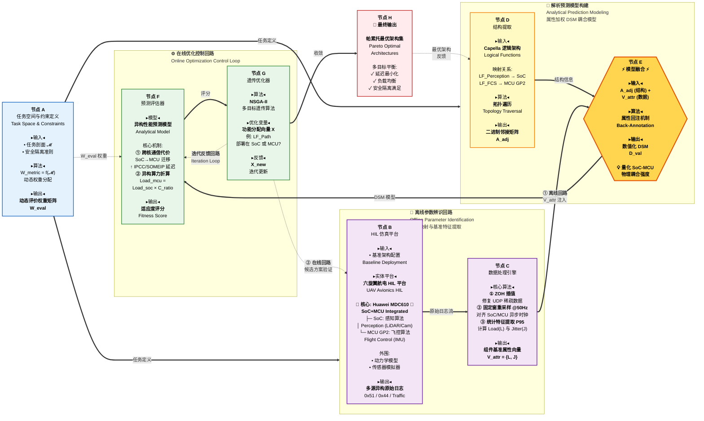

# 技术路线图 (Technical Roadmap)
## 基于数据驱动 MBSE 的六旋翼无人机航电系统架构评估与优化



---

## 图表核心说明

### � 双回路机制详解

#### 回路 1️⃣：离线参数辨识回路 (Offline Loop)
**作用**：虚实映射，从 HIL 平台提取真实性能基准

```
任务空间定义 (A) → HIL 仿真平台 (B) → 数据处理引擎 (C) → 模型融合 (E)
                     └─ MDC610 (SoC+MCU) ─┘
```

**关键节点**：
- **节点 B**：Huawei MDC610 异构平台
  - SoC 核：运行感知算法 (Perception)
  - MCU GP2 核：运行飞控算法 (Flight Control)
  - 体现 **"SoC+MCU Integrated"** 混合架构特性
- **节点 C**：数据预处理流程
  1. ZOH 插值修复 UDP 丢包
  2. 50Hz 重采样对齐异步时钟
  3. P95 统计量提取负载与抖动

**输出**：组件基准属性向量 $\mathbf{V}_{attr}$ (Load, Jitter)

---

#### 回路 2️⃣：在线优化控制回路 (Online Loop)
**作用**：基于预测模型的智能寻优

```
遗传优化器 (G) ⇄ 预测评估器 (F) ← DSM 模型 (E) ← 结构提取 (D)
     ↓                                            ↑
最优架构集 (H)                                    Capella 模型
```

**关键机制**：
- **节点 F**：异构性能预测模型
  - 跨核通信代价建模：SoC → MCU 迁移增加 IPCC/SOMEIP 延迟
  - 异构算力折算：$\text{Load}_{mcu} = \text{Load}_{soc} \times C_{ratio}$
- **节点 G**：NSGA-II 多目标遗传算法
  - 优化变量：功能分配向量 $\mathbf{X}$ (如：路径规划 LF_Path 部署在 SoC 还是 MCU？)
  - 迭代机制：$\mathbf{X}_{new}$ 反馈至节点 F 重新评估

**输出**：Pareto 最优架构集，平衡延迟、负载、安全性

---

### 🎯 核心节点功能表

| 节点 | 名称 | 输入 | 算法/操作 | 输出 |
|------|------|------|----------|------|
| **A** | 任务空间定义 | 任务剖面 $\mathcal{M}$、安全准则 | $W_{metric} = f(\mathcal{M})$ | 动态权重矩阵 $\mathbf{W}_{eval}$ |
| **B** | HIL 仿真平台 | 基准配置 | MDC610 (SoC+MCU) 运行 | 原始日志 (0x51/0x44/Traffic) |
| **C** | 数据处理引擎 | 原始日志 | ZOH + 重采样 + P95 统计 | 属性向量 $\mathbf{V}_{attr}$ |
| **D** | 结构提取 | Capella 逻辑架构 | 拓扑遍历 | 邻接矩阵 $\mathbf{A}_{adj}$ |
| **E** | 模型融合 | $\mathbf{A}_{adj}$ + $\mathbf{V}_{attr}$ | 属性回注 (Back-Annotation) | 数值化 DSM $\mathbf{D}_{val}$ |
| **F** | 预测评估器 | DSM + 候选架构 | 异构性能预测模型 | 适应度评分 |
| **G** | 遗传优化器 | 适应度评分 | NSGA-II | 新架构向量 $\mathbf{X}_{new}$ |
| **H** | 最终输出 | 优化收敛解 | Pareto 前沿选择 | 最优架构集 |

---

### 💡 核心创新点

1. **异构平台建模**：
   - 首次明确建模 **MDC610 SoC+MCU 混合架构**
   - 量化跨核通信代价 (IPCC/SOMEIP 协议延迟)

2. **属性加权 DSM**：
   - 融合 MBSE 结构 ($\mathbf{A}_{adj}$) 与 HIL 数据 ($\mathbf{V}_{attr}$)
   - 生成数值化 DSM 作为预测模型输入

3. **双回路解耦**：
   - **离线回路**：一次性完成参数辨识，避免重复实测
   - **在线回路**：基于预测模型快速迭代优化

4. **多目标优化**：
   - 同时考虑延迟、负载均衡、安全隔离约束
   - 输出 Pareto 最优解集供决策选择

---

### 🔧 实验平台架构

#### Huawei MDC610 异构计算平台
```
┌─────────────────────────────────────────┐
│          Huawei MDC610                  │
│  ┌─────────────┐   ┌─────────────────┐  │
│  │   SoC 核    │   │   MCU GP2 核    │  │
│  │  (Cortex-A) │   │  (Cortex-R)     │  │
│  │             │   │                 │  │
│  │  感知算法    │←─→│   飞控算法      │  │
│  │  Perception │IPCC│  Flight Control │  │
│  │             │   │                 │  │
│  │  LiDAR/Cam  │   │  IMU/Attitude   │  │
│  └─────────────┘   └─────────────────┘  │
│         ↕                    ↕          │
│    SOMEIP/DDS           CAN/UART        │
└─────────────────────────────────────────┘
         ↕
  外围传感器模拟器
  动力学模型仿真
```

**关键特性**：
- **异构算力**：SoC (高性能) vs MCU (高实时性)
- **通信机制**：IPCC (核间) / SOMEIP (跨域) / CAN (外设)
- **部署灵活性**：算法可在 SoC 或 MCU 间迁移

---

### 📊 数学符号说明

| 符号 | 含义 | 维度/类型 |
|------|------|----------|
| $\mathcal{M}$ | 任务剖面集合 | {起飞, 巡航, 降落, ...} |
| $\mathbf{W}_{eval}$ | 动态评价权重矩阵 | $n \times 1$ 向量 |
| $\mathbf{V}_{attr}$ | 组件属性向量 | {Load, Jitter, Bandwidth} |
| $\mathbf{A}_{adj}$ | 二进制邻接矩阵 | $n \times n$ 稀疏矩阵 |
| $\mathbf{D}_{val}$ | 数值化 DSM | $n \times n$ 加权矩阵 |
| $\mathbf{X}$ | 功能分配向量 | {0: SoC, 1: MCU} |
| $C_{ratio}$ | 异构算力折算系数 | 实数 (如 1.5) |

---

### 🎓 论文章节对应

| 图中模块 | 对应章节 | 核心内容 |
|---------|---------|---------|
| 任务空间定义 (A) | §3.2 | 动态评估体系构建 |
| HIL 平台 (B) | §4.1 | MDC610 HIL 搭建与配置 |
| 数据处理 (C) | §4.2 | 日志清洗与特征提取 |
| 结构提取 (D) | §3.1 | Capella MBSE 建模 |
| 模型融合 (E) | §3.3 | 属性加权 DSM 生成 |
| 预测评估 (F) | §3.4 | 异构性能解析模型 |
| 遗传优化 (G) | §3.4 | NSGA-II 算法实现 |
| 最优架构 (H) | §4.4 | 结果验证与对比分析 |

---

**图表版本**: v3.0 (双回路数据驱动优化技术路线图)  
**生成日期**: 2026-02-05  
**核心主题**: MDC610 异构平台 + 离线辨识 + 在线优化 + 属性加权 DSM
