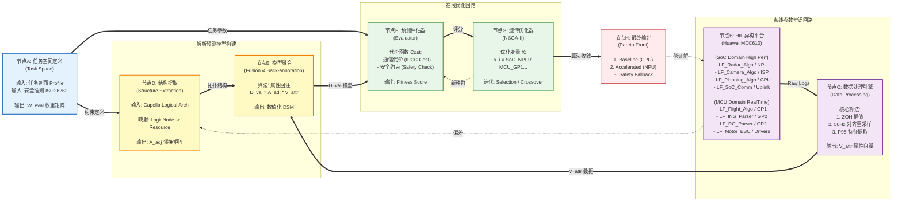

```mermaid
flowchart LR
    %% ==================== 样式定义 ====================
    %% 使用标准颜色，移除过于复杂的线条定义
    classDef inputNode fill:#E3F2FD,stroke:#1565C0,stroke-width:2px
    classDef offlineNode fill:#F3E5F5,stroke:#6A1B9A,stroke-width:2px
    classDef modelNode fill:#FFF9C4,stroke:#F57C00,stroke-width:2px
    classDef optNode fill:#E8F5E9,stroke:#388E3C,stroke-width:2px
    classDef outputNode fill:#FFEBEE,stroke:#C62828,stroke-width:2px
    
    %% ==================== 1. 任务定义 ====================
    A["节点A: 任务空间定义<br/>(Task Space)<br/><br/>输入: 任务剖面 Profile<br/>输入: 安全准则 ISO26262<br/><br/>输出: W_eval 权重矩阵"]:::inputNode
    
    %% ==================== 2. HIL 离线回路 ====================
    subgraph OFFLINE [离线参数辨识回路]
        direction TB
        
        B["节点B: HIL 异构平台<br/>(Huawei MDC610)<br/><br/>(SoC Domain High Perf)<br/>- LF_Radar_Algo / NPU<br/>- LF_Camera_Algo / ISP<br/>- LF_Planning_Algo / CPU<br/>- LF_SoC_Comm / Uplink<br/><br/>(MCU Domain RealTime)<br/>- LF_Flight_Algo / GP1<br/>- LF_INS_Parser / GP2<br/>- LF_RC_Parser / GP2<br/>- LF_Motor_ESC / Drivers"]:::offlineNode
        
        C["节点C: 数据处理引擎<br/>(Data Processing)<br/><br/>核心算法:<br/>1. ZOH 插值<br/>2. 50Hz 对齐重采样<br/>3. P95 特征提取<br/><br/>输出: V_attr 属性向量"]:::offlineNode
        
        B ==>|Raw Logs| C
    end
    
    %% ==================== 3. 预测模型构建 ====================
    subgraph MODEL [解析预测模型构建]
        direction TB
        
        D["节点D: 结构提取<br/>(Structure Extraction)<br/><br/>输入: Capella Logical Arch<br/><br/>映射: LogicNode -> Resource<br/><br/>输出: A_adj 邻接矩阵"]:::modelNode
        
        E["节点E: 模型融合<br/>(Fusion & Back-annotation)<br/><br/>算法: 属性回注<br/>D_val = A_adj * V_attr<br/><br/>输出: 数值化 DSM"]:::modelNode
        
        D ==>|拓扑结构| E
    end
    
    %% ==================== 4. 在线优化回路 ====================
    subgraph OPT [在线优化回路]
        direction TB
        
        F["节点F: 预测评估器<br/>(Evaluator)<br/><br/>代价函数 Cost:<br/>- 通信代价 (IPCC Cost)<br/>- 安全约束 (Safety Check)<br/><br/>输出: Fitness Score"]:::optNode
        
        G["节点G: 遗传优化器<br/>(NSGA-II)<br/><br/>优化变量 X:<br/>x_i = SoC_NPU / MCU_GP1...<br/><br/>迭代: Selection / Crossover"]:::optNode
        
        F ==>|评分| G
        G -.->|新种群| F
    end
    
    %% ==================== 5. 输出 ====================
    H["节点H: 最终输出<br/>(Pareto Front)<br/><br/>1. Baseline (CPU)<br/>2. Accelerated (NPU)<br/>3. Safety Fallback"]:::outputNode
    
    %% ==================== 关键连线 ====================
    %% 直接连线到内部节点，确保渲染成功
    
    A ==>|约束定义| D
    A ==>|任务参数| F
    
    C ==>|V_attr 数据| E
    E ==>|D_val 模型| F
    
    G ==>|算法收敛| H
    
    %% 反馈线
    H -.->|验证解| B
    B -.->|偏差| D
```