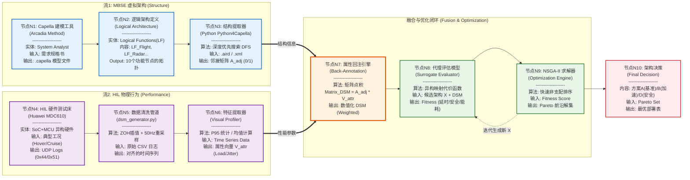

```mermaid
flowchart LR
    %% ==================== 样式定义 ====================
    %% 蓝色系：MBSE 虚拟建模流
    classDef mbse fill:#E3F2FD,stroke:#1565C0,stroke-width:2px
    %% 紫色系：HIL 物理数据流
    classDef hil fill:#F3E5F5,stroke:#6A1B9A,stroke-width:2px
    %% 橙色系：融合与DSM构建
    classDef fusion fill:#FFF3E0,stroke:#E65100,stroke-width:3px
    %% 绿色系：优化算法闭环
    classDef optim fill:#E8F5E9,stroke:#2E7d32,stroke-width:2px
    %% 红色系：最终产物
    classDef result fill:#FFEBEE,stroke:#C62828,stroke-width:2px

    %% ==========================================================
    %% 泳道 1: MBSE 虚拟架构流 (Virtual Architecture Stream)
    %% ==========================================================
    subgraph Stream_Virtual["流1: MBSE 虚拟架构 (Structure)"]
        direction TB
        
        N1["节点N1: Capella 建模工具<br/>(Arcadia Method)<br/>-------------------<br/>实体: System Analyst<br/>输入: 需求规格书<br/>输出: .capella 模型文件"]:::mbse
        
        N2["节点N2: 逻辑架构定义<br/>(Logical Architecture)<br/>-------------------<br/>实体: Logical Functions(LF)<br/>内容: LF_Flight, LF_Radar...<br/>Output: 10个功能节点的拓扑"]:::mbse
        
        N3["节点N3: 结构提取器<br/>(Python Python4Capella)<br/>-------------------<br/>算法: 深度优先搜索 DFS<br/>输入: .aird / .xml<br/>输出: 邻接矩阵 A_adj (0/1)"]:::mbse
        
        N1 --> N2 --> N3
    end

    %% ==========================================================
    %% 泳道 2: HIL 物理数据流 (Physical Data Stream)
    %% ==========================================================
    subgraph Stream_Physical["流2: HIL 物理行为 (Performance)"]
        direction TB
        
        N4["节点N4: HIL 硬件测试床<br/>(Huawei MDC610)<br/>-------------------<br/>实体: SoC+MCU 异构硬件<br/>输入: 典型工况 (Hover/Cruise)<br/>输出: UDP Logs (0x44/0x51)"]:::hil
        
        N5["节点N5: 数据清洗管道<br/>(dsm_generator.py)<br/>-------------------<br/>算法: ZOH插值 + 50Hz重采样<br/>输入: 原始 CSV 日志<br/>输出: 对齐的时间序列"]:::hil
        
        N6["节点N6: 特征提取器<br/>(Visual Profiler)<br/>-------------------<br/>算法: P95 统计 / 均值计算<br/>输入: Time Series Data<br/>输出: 属性向量 V_attr (Load/Jitter)"]:::hil
        
        N4 --> N5 --> N6
    end

    %% ==========================================================
    %% 泳道 3: 数据-模型融合与优化 (Fusion & Optimization)
    %% ==========================================================
    subgraph Phase_Fusion["融合与优化闭环 (Fusion & Optimization)"]
        direction TB
        
        N7["节点N7: 属性回注引擎<br/>(Back-Annotation)<br/>-------------------<br/>算法: 矩阵点积<br/>Matrix_DSM = A_adj * V_attr<br/>输出: 数值化 DSM (Weighted)"]:::fusion

        N8["节点N8: 代理评估模型<br/>(Surrogate Evaluator)<br/>-------------------<br/>算法: 异构映射代价函数<br/>输入: 候选架构 X + DSM<br/>输出: Fitness (延时/安全/能耗)"]:::optim
        
        N9["节点N9: NSGA-II 求解器<br/>(Optimization Engine)<br/>-------------------<br/>算法: 快速非支配排序<br/>输入: Fitness Score<br/>输出: Pareto 前沿解集"]:::optim
        
        %% 融合逻辑
        N3 ==>|"结构信息"| N7
        N6 ==>|"性能参数"| N7
        
        %% 优化闭环
        N7 --> N8
        N8 --> N9
        N9 -.->|"迭代生成新 X"| N8
    end

    %% ==========================================================
    %% 最终输出
    %% ==========================================================
    N10["节点N10: 架构决策<br/>(Final Decision)<br/>-------------------<br/>内容: 方案A(基准)/B(加速)/D(安全)<br/>输入: Pareto Set<br/>输出: 最优部署表"]:::result
    
    N9 --> N10
```